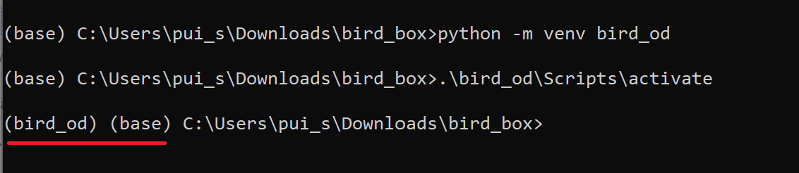

# bird_box_app
Object detection model for bird

## Setup a new virtual environment to run this app (if you never had TensorFlow Object Detection API installed)
### Step 1: 
Create a new directory to work in (for example here I will create a folder called "bird_box" in Downloads directory) and navigate to the new directory <br>
```
mkdir C:\Users\pui_s\Downloads\bird_box && cd C:\Users\pui_s\Downloads\bird_box
```

### Step 2:
Create a new virtual environment (so that your main python won't be disturbed), and name it, which is `bird_od` in this example
```
python -m venv bird_od
```

### Step 3:
Activate the virtual environment to work in. Now you will notice a bracket pre-appended to what being displayed in the command line windows as shown below
```
.\bird_od\Scripts\activate
```



### Step 4:
Create 2 new directories to store `TensorFlow Object Detection API` and its dependency `prtobuf`, here I am creating a new directory called "Tensorflow" and 2 new sub-directories for such purposes
```
mkdir Tensorflow\models;Tensorflow\protoc
```

### Step 5:
Clone TensorFlow Object Detection models
```
git clone https://github.com/tensorflow/models Tensorflow\models
```

### Step 6:
Download a zip file from https://github.com/protocolbuffers/protobuf/releases/download/v3.17.3/protoc-3.17.3-win64.zip for protobuf and uncompress it inside protoc folder, and navigate back to the main `bird_box` directory
```
move C:\Users\pui_s\Downloads\protoc-3.17.3-win64.zip Tensorflow\protoc && cd Tensorflow\protoc && tar -xf protoc-3.17.3-win64.zip
cd ..\..
```

### Step 7:
Copy `protoc.exe` to Scripts folder of the vistual environment
```
copy Tensorflow\protoc\bin\protoc.exe bird_od\Scripts
```

### Step 8:
Navigate to `Tensorflow\models\research` and install the required `object_detection` module
```
cd Tensorflow\models\research && protoc object_detection/protos/*.proto --python_out=. && copy object_detection\\packages\\tf2\\setup.py setup.py && python setup.py build && python setup.py install
```

### Step 9:
Install tf-slim
```
cd ..\..\..\Tensorflow/models/research/slim && pip install -e .
```

### Step 10:
Install `tensorflow` or `tensorflow-gpu` depending on your machine via pip
```
pip install tensorflow
```

## Step 10:
Test whether the installation has been done sucessfully
```
python ..\object_detection/builders/model_builder_test.py
```
